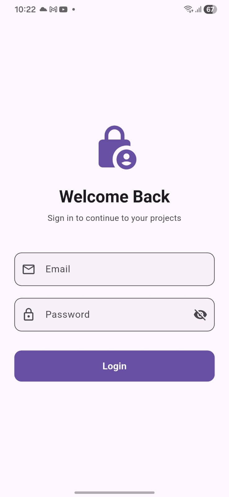
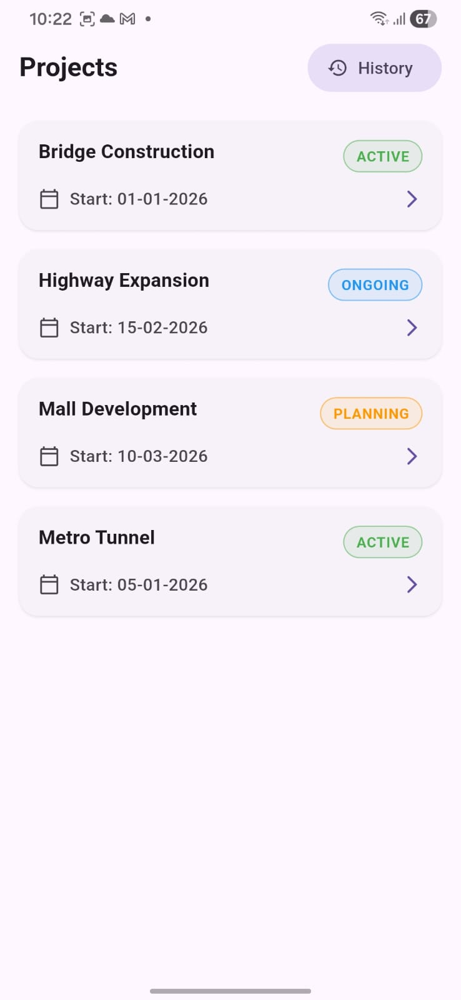
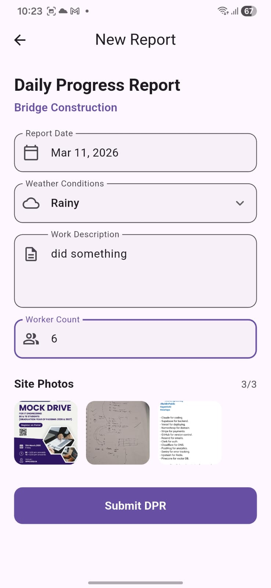
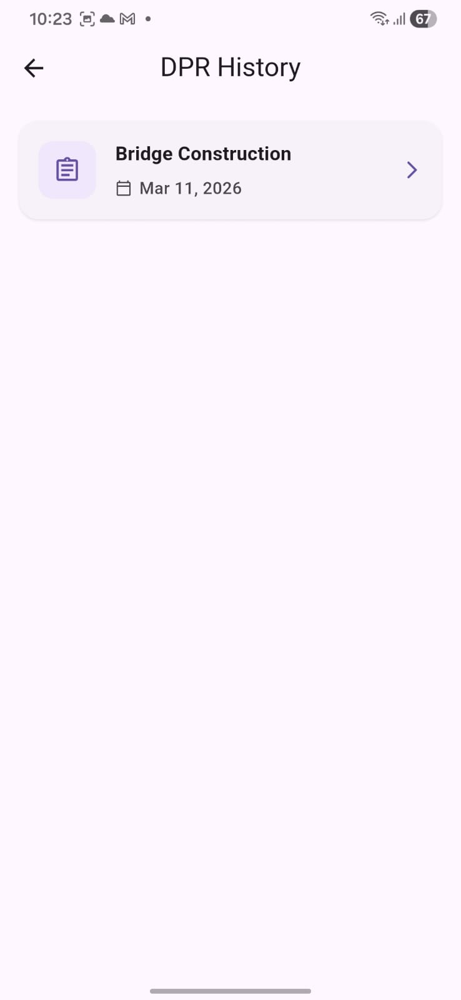
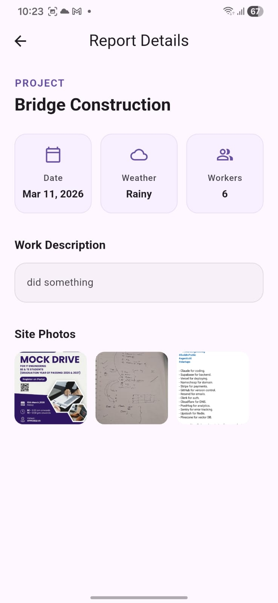

# Construction DPR (Daily Progress Report) App - Intern Selection Task

A mobile-friendly Flutter application built as part of an intern selection task. This app implements a core flow for construction site managers to log in, view active projects, and submit Daily Progress Reports (DPR) with photos.

---
## 📱 App Preview (Screenshots)

| Login Screen | Project List | DPR Form | History | Detail View |
| :---: | :---: | :---: | :---: | :---: |
|  |  |  |  |  |

---
## 🚀 Features Implemented

### Login Screen:
- Mock authentication with validation.
- Feedback on failed login attempts.
- Test Credentials: Email: test@test.com | Password: 123456

### Project List Screen:
- Displays a clean, card-based static list of projects.
- Shows Project Name, Status (with dynamic color badges), and Start Date.

### DPR Form Screen:
- Interactive Date Picker.
- Dropdown for Weather selection.
- Form validation for Work Description and Worker Count.
- Image Picker integration allowing 1 to 3 site photos from the gallery.
- Success Snackbar confirmation on submission.

### DPR History & Details (Bonus Feature):
- Maintains a local history of submitted reports.
- Detailed view of past reports including a zoomable interactive image viewer for attached photos.

---

## 🛠️ Tech Stack & Requirements

- **Flutter Framework:** Version 3.41.4 (Channel stable)
- **Dart SDK:** Version 3.11.1
- **State Management:** provider (^6.1.5+1)

### Key Packages:
- `image_picker`: ^1.2.1 (For gallery photo selection)
- `intl`: ^0.20.2 (For date formatting)
- `cupertino_icons`: ^1.0.8

---

## 📂 Code Organization & Architecture

The project follows a modular and clean architecture separating UI, business logic, and data models:
```
lib/
├── models/             # Data classes
│   ├── dpr.dart
│   └── project.dart
├── providers/          # State management logic
│   ├── auth_provider.dart
│   └── dpr_provider.dart
├── screens/            # Full-page UI views
│   ├── login_screen.dart
│   ├── project_list_screen.dart
│   ├── dpr_form_screen.dart
│   ├── dpr_history_screen.dart
│   └── dpr_detail_screen.dart
├── utils/              # Helper functions
│   ├── validators.dart
│   └── status_color_helper.dart
├── widgets/            # Reusable UI components
│   ├── project_card.dart
│   └── dpr_card.dart
└── main.dart           # App entry point
```

---

## 💡 Note on UI Composition & File Sizes

Some screen files — like `login_screen.dart`, `dpr_form_screen.dart`, and `dpr_detail_screen.dart` — are a bit longer than you might expect. That's intentional.

Flutter makes it really easy to end up with deeply nested widget trees, which can turn a simple screen into an unreadable mess. To avoid that, I kept the main build methods as clean as possible — almost like a table of contents for the screen. The heavier UI pieces (headers, input fields, stat rows, etc.) are broken out into private StatelessWidget classes at the bottom of the same file. The file gets a little longer, sure, but you can instantly understand the structure of any screen just by glancing at its build method.

---

## 💻 How to Clone and Run

**1. Clone the repository:**
```bash
git clone https://github.com/KrishPatel1605/drp_app.git
cd drp_app
```

**2. Install dependencies:**
```bash
flutter pub get
```

**3. Run the app:**
```bash
flutter run
```

---

## ⚠️ Known Issues / Limitations

- **Local State:** The app uses Provider for state management, meaning the DPR history and authentication state are stored in memory. Data will be reset when the app is completely restarted. No persistent database (like SQLite or Firebase) is attached yet.
- **Mock Auth:** Authentication is hardcoded to a specific test email and password as per the task requirements.

---

## 🎥 Walkthrough Video

Check out the full app walkthrough below to see the UI and features in action:

[**▶️ Click here to watch the Walkthrough Video on Google Drive**](https://drive.google.com/file/d/1Lo7hBL17G5zku8Z8efrDzwRze87p6cIE/view?usp=drivesdk)
